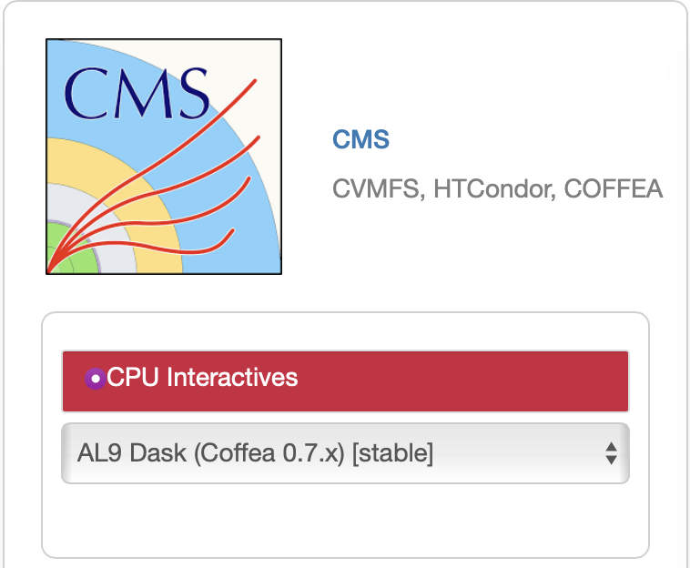

# Tagging Short Exercise

Welcome to the Tagging Short Exercise for CMSDAS 2026!

## Intro
A set of slides with introductory material, definitions, useful links is available on [Indico](https://indico.cern.ch/event/1518299/timetable/#100-tagging-exercise).
<!-- ## Setup with SWAN
Connect to https://swan.cern.ch/

If you are a participant of CMSPO&DAS@Hamburg 2023 for this POG exercise, chances are all you need to do is to go to pick the default environment (no additional environment script necessary, no paths), choose 10GB memory, and then navigate to Share -> Projects shared with me to find the project called „CMS-PODAS-2023-POG-Ex-BTV“. Pick this project, it will contain all the relevant notebooks for the exercises.

If you come here independently, no need to worry. Start similar, pick the default environment, choose 10GB memory, click the Console symbol on the top navigation bar ("New terminal") and proceed with these commands:
1. Checkout the exercise repository into new directory (example directory given below for convenience)
```shell
mkdir -p ~/SWAN_projects/POG-Exercises
cd ~/SWAN_projects/POG-Exercises
git clone https://github.com/FNALLPC/tagging-short-exercise-das.git -b podas
```
2. Start ipython notebooks via SWAN  
You can now go back to the browser tab you started with that holds your SWAN projects. Navigate to the recently cloned directory and open the individual exercises from the `notebooks` folder. -->

### Option 1: Setup with Purdue AF


- Navigate to the [Purdue AF website](https://analysis-facility.physics.purdue.edu/) and click “Login to Purdue Analysis Facility”.
- On the CILogon page, choose CERN account to log in (using Fermilab or Purdue credentials is also possible).
- You will be redirected to the “Server Options” page. The default resource selection (4 CPUs, 16 GB RAM) is enough for the HATS exercises, but you can select more resources if needed. **Do not add GPUs** to your session – there are not enough GPUs for all participants.
- Click “Start” to create your Analysis Facility session. It may take a couple of minutes to load.
- Done! Your session is ready.

- On the left panel, click on the "Git" icon. Then click on "Clone a Repository".
- Paste this git path in the text box `https://github.com/FNALLPC/tagging-short-exercise-das.git`.
- Enter your CERN username and password in the prompt.
- Go back to the file browser by clicking on the top "File Browser" icon in the left panel. You should now see a new `tagging-short-exercise-das` directory.

- Open a terminal from the main workspace (under "Other").
- Type
```shell
cd tagging
git checkout cmsdas2026
```

- Go back to the file browser and navigate to `tagging-short-exercise-das/notebooks`. Your exercise notebooks are available here. Open the first notebook to start the exercise and select `Python (pixi global)` as your kernel.


### Option 2: Setup on EAF
<details>
  <summary>Click here if you cannot set things up on Purdue AF...</summary>

To run on FNAL EAF, you will need to be on the Fermilab fgz network (if you are onsite) or use a VPN (if you are offsite, https://redtop.fnal.gov/guide-to-vpn-connections-to-fermilab/). Then login at  https://analytics-hub.fnal.gov using your FNAL Services credentials. Once you successfully connect, select CMS - CPU Interactives - AL9 Dask (Coffea 0.7.x) [stable](top left) server options, as shown in the image below. 



Click Start at the bottom of the page.

To open a Terminal click on the corresponding option in the Launcher Tab. If the Launcher tab is not open, you can open a new one from the File menu in the top left. This will open a new tab with a bash terminal.

1. The default kernel `Python 3` is sufficient for notebooks 1-3, but for the heavy resonance tagging notebook, we will need to install [Miniforge](https://github.com/conda-forge/miniforge?tab=readme-ov-file).

```shell
wget "https://github.com/conda-forge/miniforge/releases/latest/download/Miniforge3-$(uname)-$(uname -m).sh"
bash Miniforge3-$(uname)-$(uname -m).sh
```

2. Checkout this repository into new directory (example directory given below for convenience)
```shell
mkdir -p /home/username/uscmsdata/CMSDAS2026/Tagging
cd /home/username/uscmsdata/CMSDAS2026/Tagging
git clone https://github.com/FNALLPC/tagging-short-exercise-das.git -b cmsdas2026
cd tagging-short-exercise-das
```

3. Install relevant python packages into a conda-environment (comes with the Git repo)
```shell
conda env create -f env.yml
python -m ipykernel install --user --name=FTAG-Tutorial
```

4. Upload Grid Certificates - first time only!
We will copy your grid certificates from the LPC cluster, to do this, got to the terminal you just opened.
Execute the following commands (following the appropriate prompts) to copy your certificate from the LPC to Jupyter (**note**: replace `username` with your `FNAL` username!)

The following command will prompt you for your FNAL password
```bash
kinit username@FNAL.GOV
rsync -rLv username@cmslpc-el9.fnal.gov:.globus/ ~/.globus/
chmod 755 ~/.globus
chmod 600 ~/.globus/*
kdestroy
```

5. Initialize Your Proxy at every Login!
If you have a password on your grid certificate, you'll need to remember to execute the following in a terminal *each time you log in to Jupyter*. Similar to the LPC cluster, you will get a new host at each logon, and the new host won't have your old credentials.

Each time you log in, open a terminal and execute:
```bash
voms-proxy-init -voms cms -valid 192:00
```

6. Open up a terminal and run the following command from your home area to activate your conda env:
```bash
conda activate FTAG-Tutorial
```

On the left you should see the `tagging-short-exercise-das` directory you created. Click on it and then on the `notebooks` directory. 
In it there are four exercises. Start with number 1.

If doing exercises 1-3, you can use the `Python3 (Safe mode)` kernel.
If doing exercise 4-heavy-resonance-tagging, you need to use the `Python [conda env:.conda-FTAG-Tutorial]` kernel.
</details>


### Option 3: Setup with lxplus (slower, not recommended)
<details>
  <summary>Click here if you cannot set things up on Purdue AF...</summary>
Perform these initial steps for the setup at lxplus (e.g. after doing `ssh -l your-lxplus-username@lxplus.cern.ch` from your own machine):

1. Get Miniconda (if you have not yet done so in another exercise). We recommend that you do this in your eos area i.e. `/eos/user/<u>/<username>/miniconda3`
```shell
wget https://repo.continuum.io/miniconda/Miniconda3-latest-Linux-x86_64.sh
bash Miniconda3-latest-Linux-x86_64.sh
```
Special note: installation may take a while, therefore we recommend (if possible) to start early with the instructions. 

2. Checkout this repository into new directory (example directory given below for convenience)
```shell
mkdir -p /eos/user/<u>/<username>/CMSDAS2026/Tagging
cd /eos/user/<u>/<username>/CMSDAS2026/Tagging
git clone https://github.com/FNALLPC/tagging-short-exercise-das.git -b cmsdas2026  # Enter your CERN username and password when prompted
cd tagging-short-exercise-das
```

3. Install relevant python packages into a conda-environment (comes with the Git repo)
```shell
conda env create -f env.yml
```

4. Connect to a screen session (to start jupyter lab server and open in browser). A screen session ensures that your jupyter server keeps running within lxplus even if your ssh session get disconnected from lxplus.
```shell
screen -S server
```
Within that new screen-session, make sure to have the active conda environment:
```shell
conda activate FTAG-Tutorial
```  
and start a jupyter lab server with forwarding to a specific port (choose a random four-digit number XXXX: the 7890 is just an example, ***do not use 7890***!)
```shell
jupyter lab --no-browser --port=7890
```
Note down
- the machine you were working with (most likely, something like lxplusXYZ).
- the port you have chosen above.
- the first http-link presented to you after starting the jupyter server instance (something like http://localhost:XXXX...). You can copy this with `Ctrl/Cmd+C`

Useful `screen` commands: Within this ssh connection, you may detach from the screen via `Ctrl + A` (hold down `Ctrl`) followed by `D` (while `Ctrl` is pressed). One can always go back to this screen-session via `screen -r server` from the same lxplus machine.

On your **own laptop/machine**: from a new terminal, connect to the port on which you started the server (pick the exact machine you worked with for the previous step):
Example:
```shell
ssh -L 7890:localhost:7890 username@lxplus934.cern.ch
```
General case:
```shell
ssh -L XXXX:localhost:XXXX your-username@lxplusXYZ.cern.ch
```
Now open your browser and paste the http-link you copied. Navigate to `notebooks` on your left panel.

All packages to work with the exercises should be available from there, you don't need to use the terminal from now on, just keep the session open while you're working.
</details>


## Tutorials
All individual tutorials / exercises are available from the `notebooks` directory. There are four .ipynb files which are plug-and-play, just (double-)click to open and follow the instructions inside.

Jupyter tip: To run a command, click on it inside the Jupyter notebook and click the play button on the top panel. You can edit the command and rerun it by clicking the run button again. Click the play button again to run the next command, and so on. An alternative to the play button is to press Shift+Return.

### Acessing Tagger Outputs
Access AK4 and AK8 jet tagger information from standard NanoAOD files. Explore how these distributions look like for various flavours of jets and heavy objects.
### Performance
Learn how network performance is evaluated and which performance metrics play a key role for flavour tagging. Perform more studies to evaluate performance as a function of certain parameters and compare across samples.
### Scale Factors
Scale Factors are essential before we can use taggers on real collision data. Explore one of the methods that are used to compare simulation and data and extract correction factors.
### Heavy Resonance Tagging
Make your own tagger for heavy-resonances and compare yours to the CMS taggers. 
Explore how performance depends on kinematic quantities related to the jet.
This is one concept to keep in mind, differential distributions *do* matter (not only inclusive metrics), in this case explored for simple features like pseudorapidity and transverse momentum. Most likely you will also need to adapt to differentially measured scale factors (in bins of disciminators, though) when using such algorithms in an analysis.


## Contact
This session:

**_Honor Lahare, 2026_**  
:email: [honor.suzanne.hare@cern.ch](mailto:honor.suzanne.hare@cern.ch), :computer: [@hohare](https://github.com/hohare)

Maintained by:

**_Irene Dutta, 2025_**  
:email: [irene.dutta@cern.ch](mailto:irene.dutta@cern.ch), :computer: [@irenedutta23](https://github.com/irenedutta23)

**_Spandan Mondal, 2024_**  
:email: [spandan.mondal@cern.ch](mailto:spandan.mondal@cern.ch), :computer: [@mondalspandan](https://github.com/mondalspandan)

**_Sebastian Wuchterl, CMS PO&DAS 2023_**  
:email: [sebastian.wuchterl@cern.ch](mailto:sebastian.wuchterl@cern.ch), :computer: [@SWuchterl](https://github.com/SWuchterl)

**_Svenja Diekmann, CMS PO&DAS 2023_**  
:email: [svenja.diekmann@cern.ch](mailto:svenja.diekmann@cern.ch), :computer: [@SvenjaDiekmann](https://github.com/SvenjaDiekmann)


Orignal credits to:
**_Annika Stein, 2023_**  
:email: [annika-stein@cern.ch](mailto:annika-stein@cern.ch), :computer: [@AnnikaStein](https://github.com/AnnikaStein)